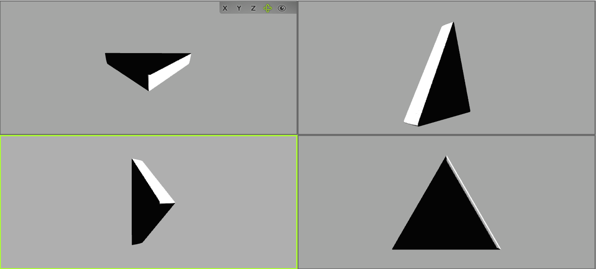
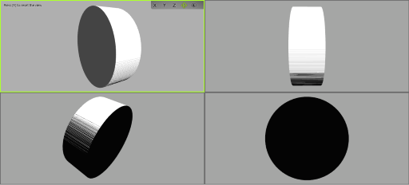

# Adinkra Extrusion Converter version 3.0
================================================================
Requires csdt_stl_tools in order to function properly due to Python 3 updates.

Additional documentation and setup for PyPi can be found [here](https://docs.google.com/document/d/1dkEE18c57dyifXEf-jxpAI8IP1ybXcsHqCkcuO1AexM/edit#heading=h.gvvoz8ixpl42).

Note: You need to be added to our PyPi repository to make your have your changes reflected on the site.
Also, make sure to remember to update requirements.txt in csdt_website to latest version of csdt_stl_converter. Finally, this README might be slightly outdated. If there are any discrepancies, please submit the changes that worked for you.

Python 3.7.3


================================================================

This project contains routines to convert an Adinkra symbol in jpeg/png format and converts it to an STL file for 3D printing.

Make sure that the image background is either white (#FFFFFF) or transparent.

This can be used for any image, not just Adinkra symbols.

# Release Note
    - version 1.0/2.7: Project is first pushed to production
    - version 1.1/2.7: Added an option to generate a negative mold as well as fixing issues with [r, g, b] channels
  - - version 3.0: Updated to Python3 and set up for PyPi package updates

# Requirement 
 - Python 3.7.3 (higher *should* be alright)
 - Numpy 1.18.5
 - OpenCV-Python 4.4.0.42 (for reading and resizing images)
 - Scipy 1.5.2 (for scipy.ndimage.gaussian_filter)
 - csdt_stl_tools 0.3.1 

# Installation
Adinkra_converter can be used as is.

The dependencies may be installed via pip with (This may vary based on your particular system and requirements reflected above)
```
python -m pip install numpy
python -m pip install opencv-python
python -m pip install scipy
python -m pip install csdt_stl_tools
```

# Usage Examples:
image2stl.py contains the routines needed to convert images to STL, while adinkra_converter.py contains the interface that users interact with.
adinkra_converter.py receives parameter options via the command line.

Here is the template for invoking adinkra_converter.py:\
`python adinkra_converter.py [-b/--base True/False] [-g/--smooth True/False] [-c/--negative True/False][-s/--size size] [-x/-scale scaling] image_directory stl_directory`

`-b False` or `--base=False` specifies that a base is added; False would indicate not adding a base (this is the default option).\
`-g True` or `--smooth=True` specifies that the image is smoothed before converting to STL; False would disable this feature (default option).\
`-c False` r `--negative=False` specifies that the image is used to generate a square with the image object as a  (default option is False). \
`-s 480` or `--size=480` specifies that the image be resized to (480x480) (default option).\
`-x 0.1` or `--scale=0.1` scales the resulting STL mesh height to 1/10 (default option).

`image_directory` is the directory where the image to convert to STL resides.

`stl_directory` is the directory in which to save the resulting STL file.


A few examples on how to use image2stl.py/adinkra_converter.py are shown below.\
(NOTE: the use of an STL mesh viewer is recommended.)


on [an image of a circle](sample/images/circle.png?raw=false "circle.png"):\


with adinkra_converter.py via the command line:\
`python adinkra_converter.py --base=True sample/images/circle.png sample/stl/circle_with_base.stl`

with image2stl.py:
```Python
import image2stl

image = image2stl.read_image("sample/images/circle.png")
image_white_background = image2stl.convert_transparent_to(image, [255, 255, 255]) # transparent to #FFFFFF
resized_image = image2stl.convert_to_standard_size(image_white_background, size=256)
grayscaled_image = image2stl.grayscale(resized_image)
smoothed_image = image2stl.smooth_image(grayscaled_image, standard_deviation=1)
inverted_image = image2stl.grayscale_negative(smoothed_image)
image2stl.convert_to_stl(inverted_image, "sample/stl/circle_with_base.stl", base=True, output_scale=0.1)
```

You should get an [circle mesh with base](sample/stl/circle_with_base.stl "STL") that looks like this (opened with Open 3D Model Viewer):\


on [an image of a triangle](sample/images/triangle.png?raw=false "triangle.png"):\


with adinkra_converter.py via the command line:\
`python adinkra_converter.py --base=False sample/images/triangle.png sample/stl/triangle.stl`


with image2stl.py:
```Python
import image2stl

image = image2stl.read_image("sample/images/triangle.png")
image_white_background = image2stl.convert_transparent_to(image, [255, 255, 255]) # transparent to #FFFFFF
resized_image = image2stl.convert_to_standard_size(image_white_background, size=256)
grayscaled_image = image2stl.grayscale(resized_image)
smoothed_image = image2stl.smooth_image(grayscaled_image, standard_deviation=1)
inverted_image = image2stl.grayscale_negative(smoothed_image)
image2stl.convert_to_stl(inverted_image, "sample/stl/triangle.stl", base=False, output_scale=0.1)
```

You should get an [triangle mesh](sample/stl/triangle.stl "STL") that looks like this (opened with Open 3D Model Viewer):\



**convert_to_stl** technically filters out black pixels, but the adinkra_converter gives a negative of the input image\
thus, it's possible to do something like (using the same circle image above):
```Python
import image2stl

image = image2stl.read_image("sample/images/circle.png")
image_white_background = image2stl.convert_transparent_to(image, [0, 0, 0]) # transparent to #000000
grayscaled_image = image2stl.grayscale(image)
image2stl.convert_to_stl(grayscaled_image, "sample/stl/cylinder.stl", base=False, output_scale=1.0)
```

This will yield a cylinder mesh like so:\



# image2stl Function References

**read_image(image_directory, read_mode)**
```
This function reads in an image directory as a string and returns a numpy array of pixels in the image

:required_parameter image_directory: (String) The path in which the image resides
    The path can be a relative path to this script or an absolute path

:optional_parameter read_mode: (constants from cv2) This constants controls
    how to represent the pixels in the image. The constants include but is not limited to:
        cv2.IMREAD_COLOR - represent pixels as an array designating [red, green, blue] channels
        cv2.IMREAD_GRAYSCALE - represent pixels as intensity information
            0.0 being completely black and 1.0 being completely white
        cv2.IMREAD_UNCHANGED - represent pixels as an array designating [red, green, blue, alpha] channels

:return: (numpy.ndarray) an array of pixels representing the opened image
```


**convert_to_standard_size(image_matrix, size=256)**
```
Resize the images and change the aspect ratio to 1:1.

:required_parameter image_matrix: (numpy.ndarray) A 2D array of pixels of the image to resize
:optional_parameter size: (int) The desired size of the output image
    The default parameter specifies an output image of 256 x 256

:return: (numpy.ndarray) A 2D array of pixels representing the resized image
```


**grayscale(image_matrix)**
```
Converts colored images to grayscale
Only works for RGB or RGBA images

:required_parameter image_matrix: (numpy.ndarray) A 2D array of pixels representing an image
:return: (numpy.ndarray) A 2D array of pixels representing a grayscaled image
```


**smooth_image(image_matrix, standard_deviation = 1)**
```
Smooths out images using the Gaussian function

:required_parameter image_matrix: (numpy.ndarray) A 2D array of pixels representing an image
:optional_parameter standard_deviation: The standard deviation of the Gaussian function
    The default standard deviation is 1

:return: (numpy.ndarray) A 2D array of pixels representing a smoothed image
```


**convert_transparent_to(image_matrix, target_pixel)**
```
Converts all transparent pixels into white pixels
Only works on [r, g, b, a] pixels

:required_parameter image_matrix: (numpy.ndarray) a 2D array of pixels of the image to whiten
:optional_parameter target_pixel: (numpy.ndarray) a [r, g, b] pixel to replace transparent pixels with
:return: (numpy.ndarray) a 2D of pixels representing the whitened image
```


**grayscale_negative(image_matrix)**
```
Converts the grayscaled image array into its respective negative

:required_parameter image_matrix: (numpy.ndarray) The desired grayscale image to create a negative of
:return: The resulting negative image
```


**convert_to_stl(image_matrix, output_file_directory, base=False, output_scale=0.1)**
```
Converts the image matrix into an STL file and save it at output_file_directory
NOTE: This function currently only supports grayscale

:required_parameter image_matrix: (numpy.ndarray) A 2D array of pixels representing an image
:required_parameter output_file_directory: (string) The filename of the resulting STL file
:optional_parameter output_scale: decides the height scaling of the resulting STL mesh
:optional_parameter base: (boolean) A boolean value specifying whether or not
    to include a base into the resulting STL file
```
